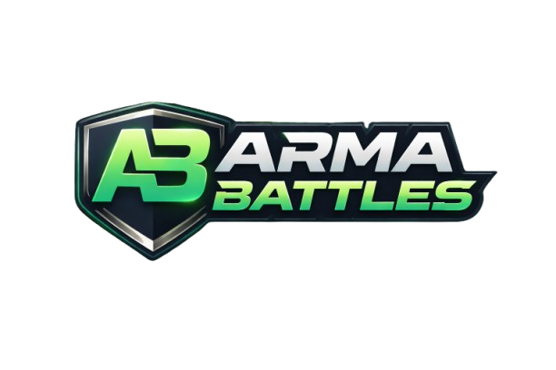

<p align="center">
  
</p>

<h1 align="center">ArmaBattles</h1>

<p align="center">
  <strong>The ultimate community platform for Arma Reforger</strong>
</p>

<p align="center">
  Real-time server tracking &bull; Player statistics &bull; Tournaments &bull; Anti-cheat &bull; Live activity feeds
</p>

<p align="center">
  <a href="https://armabattles.com"></a>&nbsp;
  <a href="#"></a>&nbsp;
  <a href="#"></a>&nbsp;
  <a href="#"></a>&nbsp;
  <a href="LICENSE"></a>
</p>

<br>

---

<br>

## About

ArmaBattles is a full-featured community hub built specifically for Arma Reforger. It connects players, tracks live game server data, powers competitive play through tournaments and scrims, and gives admins the tools to manage everything from a single dashboard.

Built with **Laravel 12**, **PostgreSQL**, **Alpine.js**, and **Tailwind CSS 4**, with real-time WebSocket updates via **Laravel Reverb**.

<br>

## Features

### Server Tracking & Monitoring
- Live server status via **BattleMetrics API** and **A2S UDP protocol**
- Player count history, mod lists, and FPS/memory/uptime performance graphs
- Multi-server management from a unified admin panel
- Embeddable server status widgets for external sites
- Server comparison dashboard with side-by-side live metrics
- Kill/death heatmap overlay on interactive **Leaflet.js** maps

### Player Statistics & Leaderboards
- Comprehensive combat stats — kills, deaths, K/D ratio, headshots, roadkills, team kills
- Hit zone tracking with body region breakdown (head, torso, arms, legs)
- Weapon and vehicle statistics with per-weapon leaderboards
- XP tracking, distance traveled, grenades thrown, heals given, supplies delivered
- Player search with autocomplete and comparison tool (up to 4 players, radar charts)
- Head-to-head matchup data between two players
- CSV and JSON export for player stats and leaderboards

### Tournament System
- **Four bracket formats:** Single elimination, double elimination, round robin, Swiss
- Team registration with approval workflow
- Match scheduling, check-in system, and referee dashboard
- Match reporting with referee notes
- Automated 24h and 1h match reminders via email

### Platoon (Team) Management
- Create and manage platoons with custom name, tag, and branding
- Invitation and application system with approval workflow
- Captain tools — promote, kick, disband
- Platoon profile pages and leaderboards

### Scrim System
- Casual team-vs-team match scheduling outside of tournaments
- Invitation system with 7-day expiry
- Status flow: pending → scheduled → in_progress → completed/cancelled
- Optional server password protection

### Achievement System
- Category-based achievements with automated progress tracking
- Dynamic rarity calculation based on unlock percentage
- Profile showcase — pin up to 3 achievements
- Hourly automated checks against player stats

### Reputation System
- Community +Rep / -Rep voting with categories (teamwork, leadership, sportsmanship)
- Reputation tiers: Trusted, Good, Neutral, Poor, Flagged
- 24-hour vote change window
- Public reputation leaderboard

### Content Creators & Clips
- Multi-platform streamer directory (Twitch, YouTube, TikTok, Kick)
- Highlight clip submission with community voting
- **Clip of the Week** feature

### News Hub
- Community news articles with rich text editor
- Official Arma Platform news synced automatically with full article content
- Comments and **Hoorah** reactions on all articles
- Pinned articles and source badges (Official / Community)

### Anti-Cheat Integration
- **Raven Anti-Cheat** event logging and enforcement tracking
- Real-time stats dashboard with cheater detection monitoring
- Periodic snapshots of online/active/banned player counts

### Real-Time Features
- **WebSocket** updates via Laravel Reverb (kill feed, player connections, server status)
- Live activity feed sidebar with clickable player profile links
- Desktop notification API with browser permission prompts
- Notification system with category filtering (team, match, achievement)
- Discord Rich Presence integration

### Admin Panel
- **Server Manager** — restart scheduling, broadcast templates, RCON commands, mod update checker
- **Game Stats Dashboard** — detailed event tables, player profiles, raw data inspection
- **Player History** — search by name/UUID, connection logs, ban by GUID
- **Metrics & Tracking** — page views, API usage analytics, system performance (P50/P95/P99)
- **Audit Logging** — admin action history with filters and CSV export
- **API Token Management** — tiered rate limiting (standard, high-volume, premium)
- **Site Settings** — branding, maintenance mode, SEO, custom CSS injection
- **News Management** — create, edit, pin, and delete community articles

### Security & Auth
- **Steam OpenID** authentication
- Optional **two-factor authentication** (TOTP — Google Authenticator, Authy)
- 8 single-use recovery codes
- Admin can reset user 2FA
- Role-based access: user, moderator, admin, GM, referee, observer, caster

<br>

## Tech Stack

| Layer | Technology |
|:------|:-----------|
| **Framework** | Laravel 12 (PHP 8.3) |
| **Database** | PostgreSQL 16 |
| **Frontend** | Blade templates, Alpine.js, Tailwind CSS 4 |
| **Real-Time** | Laravel Reverb (WebSockets), Laravel Echo, Pusher.js |
| **Authentication** | Steam OpenID, Laravel Sanctum, TOTP 2FA |
| **Build Tool** | Vite 7 |
| **Charts** | Chart.js |
| **Maps** | Leaflet.js |
| **Queue / Cache** | Database driver |
| **Backups** | PostgreSQL dumps → Backblaze B2 (via rclone) |

<br>

## API

ArmaBattles exposes a versioned REST API at `/api/v1/` secured with **Laravel Sanctum** bearer tokens.

| Category | Endpoints |
|:---------|:----------|
| **Combat** | Player kills, damage events (batch) |
| **Players** | Connections, stats, search, profiles |
| **Objectives** | Base capture/seizure events |
| **World** | Building, consciousness, group events |
| **XP** | XP reward events |
| **Social** | Chat messages, editor actions, GM sessions |
| **Game State** | Server status snapshots |
| **Movement** | Distance, grenades, shooting, healing, supplies |
| **Anti-Cheat** | Raven AC events and periodic stats |
| **Read** | Servers, players, leaderboards, event logs, stats aggregates |

Rate limits are per-token: **60/min** (standard), **180/min** (high-volume), **300/min** (premium).

Interactive API documentation (Swagger UI) is available at [`/api/docs`](https://armabattles.com/api/docs).

<br>

## Project Structure

```
app/
├── Http/Controllers/
│   ├── Admin/              # Admin panel controllers
│   ├── Api/                # StatsController, AnticheatController
│   └── Auth/               # Steam OAuth, 2FA
├── Models/                 # Eloquent models
├── Services/               # BattleMetrics, A2S, Workshop, GameServerManager
├── Events/                 # WebSocket broadcast events
├── Listeners/              # Event listeners
└── Mail/                   # Queued mailable classes
resources/
├── views/
│   ├── layouts/            # App layout with sidebars
│   ├── admin/              # Admin panel views
│   ├── profile/            # Player profile views & partials
│   ├── news/               # News hub views
│   ├── tournaments/        # Tournament bracket views
│   └── partials/           # Reusable components (activity feed, etc.)
├── css/                    # Tailwind CSS + custom styles
└── js/                     # Alpine.js components, animations
database/
└── migrations/             # All database migrations
routes/
├── web.php                 # Web routes
├── api.php                 # API routes (v1 + legacy)
├── channels.php            # WebSocket channel authorization
└── console.php             # Scheduled tasks
```

<br>

## License

This is **proprietary software**. All rights reserved.

See [LICENSE](LICENSE) for the full terms.

<br>

---

<p align="center">
  <sub>Built with dedication for the Arma Reforger community</sub><br>
  <strong>&copy; 2026 <a href="https://armabattles.com">ArmaBattles.com</a></strong>
</p>
