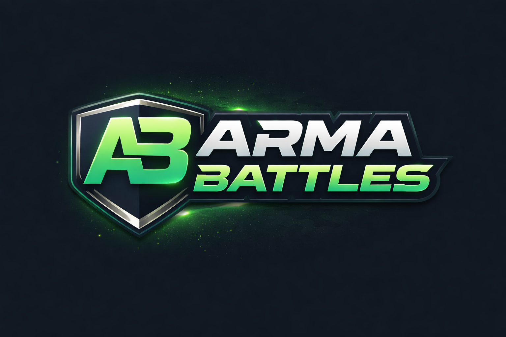

  

<h1 align="center">ArmaBattles</h1>

  <strong>Community platform for Arma Reforger servers</strong> 
  Real-time server tracking, player statistics, tournaments, and more.

  <a href="https://armabattles.com">armabattles.com</a>

---

## Overview

ArmaBattles is a full-featured community platform built for Arma Reforger. It connects players, tracks live server data, and provides tools for competitive play and community management.

## Features

### Server Tracking
- Live server monitoring via BattleMetrics and A2S protocol
- Player count history, mod lists, and server performance graphs
- Multi-server management from a single admin panel
- Embeddable server status widgets for external sites

### Player Statistics
- Comprehensive combat stats: kills, deaths, K/D, headshots, roadkills
- Hit zone tracking with body map visualization
- Weapon and vehicle statistics with leaderboards
- XP tracking, distance traveled, grenades thrown, heals given
- Player search with autocomplete and comparison tools
- CSV/JSON export for stats and leaderboards

### Tournament System
- Single elimination, double elimination, round robin, and Swiss bracket formats
- Team registration, match scheduling, and check-in system
- Referee dashboard with match reporting
- Automated match reminders via email

### Platoon (Team) Management
- Create and manage platoons with custom branding
- Invitation and application system
- Team comparison tools
- Platoon leaderboards

### Scrim System
- Casual team-vs-team match scheduling
- Invitation system with 7-day expiry
- Optional server password protection

### Achievement System
- Category-based achievements with progress tracking
- Rarity calculation and profile showcase (pin up to 3)
- Automated checking against player stats

### Reputation System
- Community +Rep/-Rep voting with categories
- Reputation tiers: Trusted, Good, Neutral, Poor, Flagged
- Public reputation leaderboard

### Content Creators
- Multi-platform streamer directory (Twitch, YouTube, TikTok, Kick)
- Highlight clip submission with community voting
- Clip of the Week feature

### Anti-Cheat Integration
- Raven Anti-Cheat event logging and stats dashboard
- Enforcement action tracking
- Real-time cheat detection monitoring

### Community Features
- Steam authentication
- Two-factor authentication (TOTP)
- News articles with comments and "hoorah" reactions
- Notification system with desktop alerts
- Discord Rich Presence integration
- Player favorites (players, teams, servers)
- Live activity feed

### Admin Tools
- Server manager: restart scheduling, broadcast messages, RCON, mod updates
- Game stats dashboard with detailed event tables
- Player history search and ban management
- Audit logging with CSV export
- Site settings with maintenance mode
- API token management with tiered rate limiting

## Tech Stack

| Layer | Technology |
|-------|-----------|
| Framework | Laravel 12 |
| Database | PostgreSQL |
| Frontend | Blade, Alpine.js, Tailwind CSS 4 |
| Auth | Steam OpenID, Laravel Sanctum |
| Build | Vite 7 |
| Queue | Database driver |
| Cache | Database driver |

## API

ArmaBattles exposes a versioned REST API (`/api/v1/`) with Sanctum authentication for:

- Game server event ingestion (kills, connections, damage, XP, chat, etc.)
- Player and server statistics
- Leaderboards
- Anti-cheat event reporting

Interactive API documentation (Swagger UI) is available at `/api/docs`.

## License

This project is proprietary software. See [LICENSE](LICENSE) for details.

All rights reserved by ArmaBattles.com.
